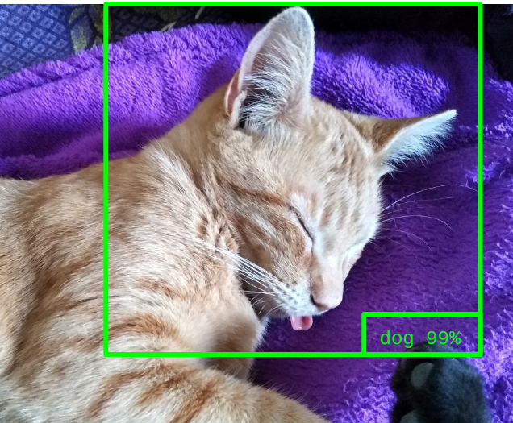

# Michigrad - LeIA 2025

Pequeño motor de Autograd con fines educativos, desarrollado como parte del Trabajo Práctico Nº9 de la cátedra de **Lógica e Inteligencia Artificial**.



Este proyecto es un fork de una implementación minimalista de backpropagation (basada en [Micrograd](https://github.com/karpathy/micrograd) de Andrej Karpathy), extendido para soportar nuevas funciones de activación y arquitecturas modulares.

### 👥 Integrantes
* Cestorame, Giuliana María
* Gerez, Marcos Mateo
* Reale, Ezequiel Iván

## 🚀 Características y Extensiones

Michigrad permite construir grafos de computación dinámica para calcular gradientes automáticamente. Además de las operaciones escalares básicas, esta versión incluye las siguientes extensiones requeridas por el TP:

* **Nuevas Funciones de Activación:** Se implementaron `Tanh` y `Sigmoid` (Logística) con sus respectivas derivadas para el paso de *backward*, además de la `ReLU` existente.
* **Arquitectura Modular:** Se extendió la capacidad de construcción de redes mediante clases modulares (disponibles en `michigrad/enhanced_nn.py`) que permiten apilar capas de forma flexible.
* **Resolución del problema XOR:** Se incluyen scripts de prueba que demuestran la incapacidad de los modelos lineales para resolver problemas no linealmente separables y cómo la incorporación de capas ocultas con no-linealidades resuelve el problema.

## 🛠️ Uso de Michigrad

### Ejemplo básico (Escalares)

```python
import numpy as np
from michigrad.engine import Value
from michigrad.visualize import show_graph

# Definición de variables y pesos
x = Value(0.5, name="x")
w = Value(0.8, name="w")
b = Value(0.1, name="b")

# Forward pass con activación Tanh
n = x * w + b
o = n.tanh()

# Backward pass
o.backward()

print(f"Gradiente de x: {x.grad}")
````

### Reproducción de Experimentos XOR

El repositorio incluye dos scripts para demostrar el aprendizaje (o la falta de él) en la función XOR:

1.  **Modelo Lineal (Falla):**

    ```bash
    python xor_punto_1.py
    ```

    *Muestra cómo una red sin activaciones no lineales no puede reducir la pérdida en el problema XOR.*

2.  **Modelo No-Lineal (Éxito):**

    ```bash
    python xor_punto_3.py
    ```

    *Entrena un MLP con capas ocultas y activación Tanh/ReLU, logrando convergencia y resolviendo el problema.*

## 📦 Instalación y Requisitos

1.  Clonar el repositorio.
2.  Instalar las dependencias:
    ```bash
    pip install -r requirements.txt
    ```
3.  Para la visualización de grafos es necesario tener instalado **Graphviz** en el sistema.
